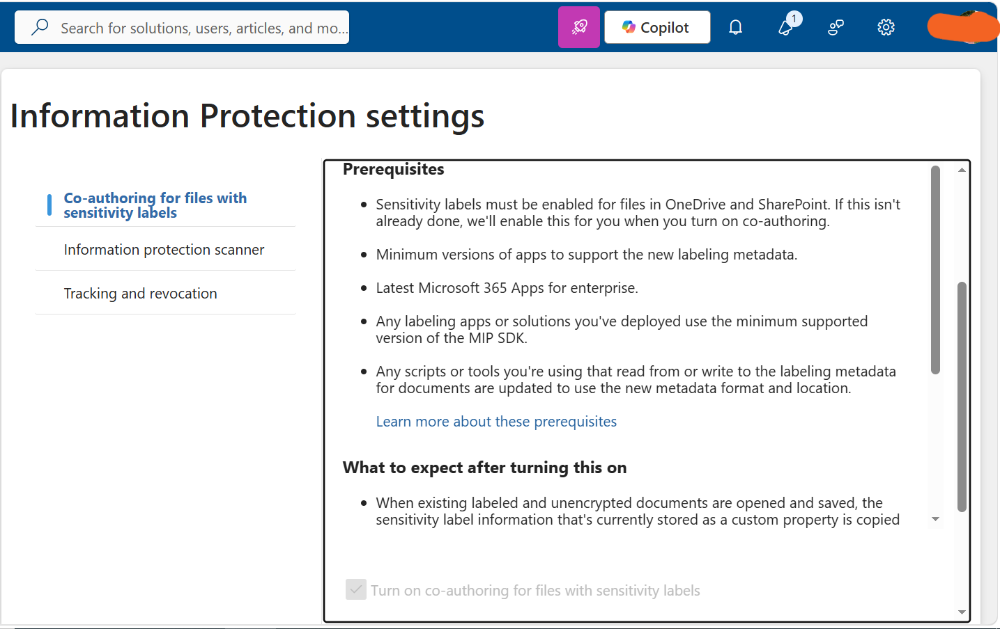

# Task 1: Enable Support for Sensitivity Labels

## Objective

Enable co-authoring support for files protected with sensitivity labels in Microsoft Purview.

## Configuration

Enabled co-authoring for files protected with sensitivity labels.

This configuration also enables sensitivity label support for files stored in:

- SharePoint Online
- OneDrive

## Steps Performed

1. Opened **Microsoft Purview**.
2. Navigated to the **Information Protection** settings.
3. Enabled co-authoring support for files protected with sensitivity labels.
4. Verified that the configuration was successfully applied.

## Tools

- Microsoft Purview
- Information Protection

## Outcome

Successfully enabled co-authoring support for sensitivity-labeled files, including files stored in SharePoint Online and OneDrive.

## Evidence

