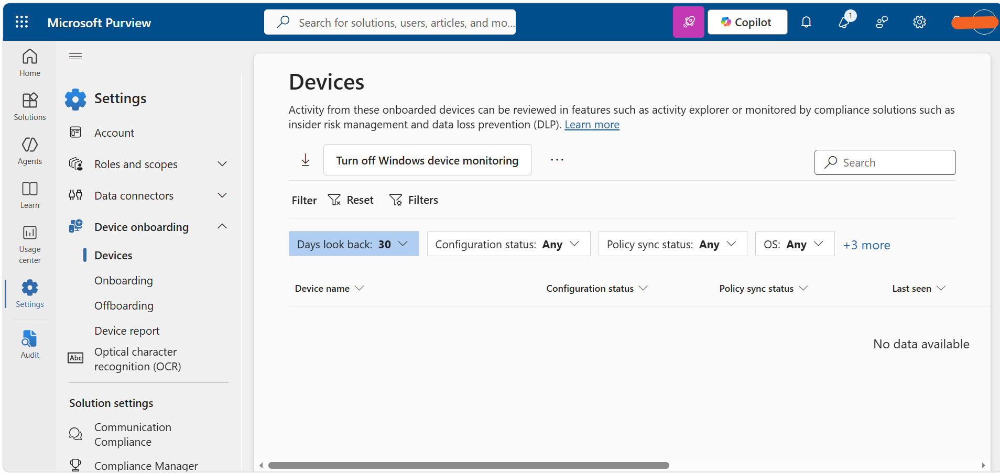

## Task 2: Enable Device Onboarding

Enabled device onboarding in Microsoft Purview to allow organizational devices to be monitored and subsequently protected using Endpoint Data Loss Prevention (DLP) policies.

**Tools:** Microsoft Purview, Endpoint DLP

**Outcome:** Device onboarding was enabled successfully, with device monitoring activated for the organization.

## Evidence

