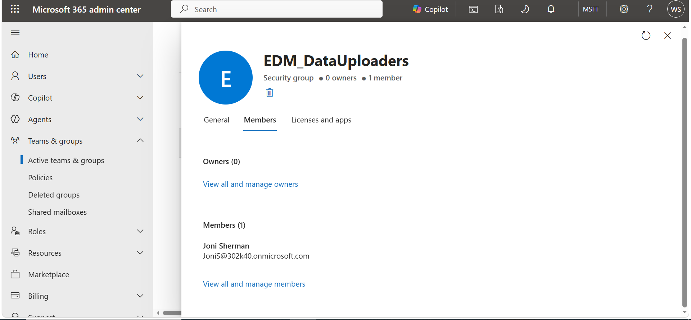
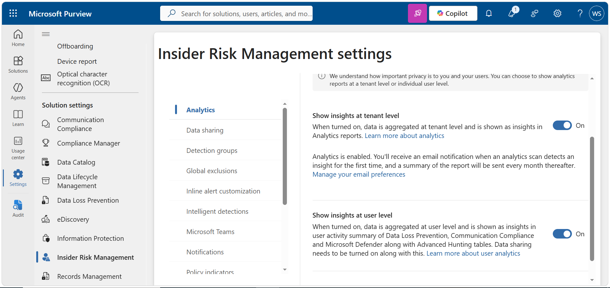
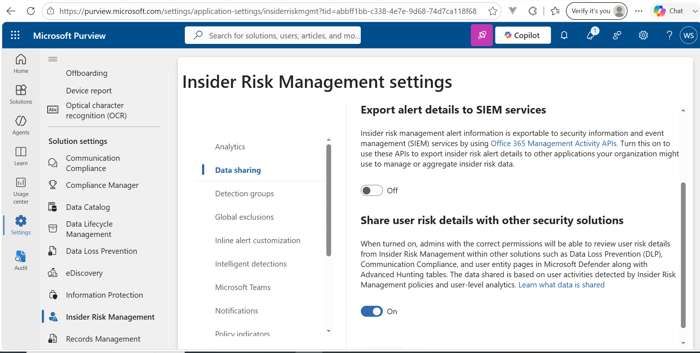

## Task 3: Enable Insider Risk Analytics and Data Sharing

Configured Insider Risk Management analytics and data sharing in Microsoft Purview by enabling tenant- and user-level insights and allowing user risk details to be shared with other security solutions.

**Tools:** Microsoft Purview, Insider Risk Management

**Outcome:** Insider Risk Management analytics and data sharing were successfully enabled.

## Evidence

