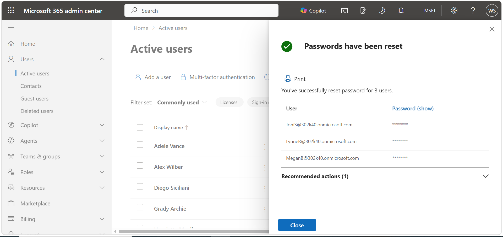

# Task 4: Set User Passwords for Lab Exercises

## Objective

Prepare the required Microsoft 365 user accounts for use in subsequent security and compliance lab exercises by configuring passwords for the designated lab users.

## Users Configured

The following Microsoft 365 user accounts were configured through the **Microsoft 365 Admin Center**:

- **Joni Sherman**
- **Lynne Robbins**
- **Megan Bowen**

## Steps Performed

1. Signed in to the **Microsoft 365 Admin Center**.
2. Navigated to the user management section.
3. Located the required lab user accounts.
4. Reset the passwords for Joni Sherman, Lynne Robbins, and Megan Bowen.
5. Confirmed that the password changes were successfully applied.

## Tools

- Microsoft 365 Admin Center

## Outcome

Passwords were successfully reset for all three lab user accounts, enabling them to be used in subsequent security and compliance exercises.

## Evidence

