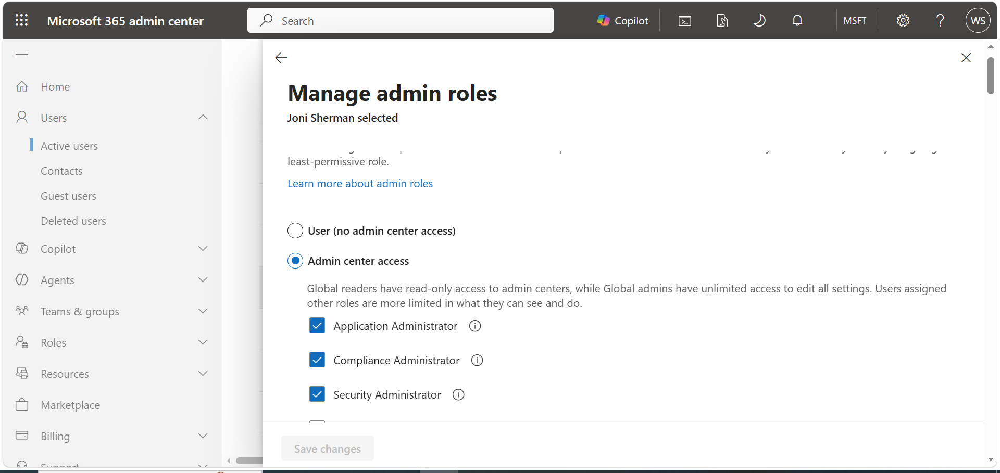

# Task 1: Assign Administrative Roles

## Objective

Assign the required administrative roles to **Joni Sherman** to provide the permissions required for subsequent information protection and security exercises.

## Roles Assigned

The following administrative roles were assigned to Joni Sherman:

- **Application Administrator**
- **Compliance Administrator**
- **Security Administrator**

## Steps Performed

1. Signed in to the **Microsoft 365 Admin Center**.
2. Located the **Joni Sherman** user account.
3. Assigned the required administrative roles.
4. Verified the assigned roles through **Microsoft Entra ID**.

## Tools

- Microsoft 365 Admin Center
- Microsoft Entra ID

## Outcome

Administrative roles were successfully assigned and verified for the lab user, providing the required permissions for subsequent information protection and security exercises.

## Evidence

