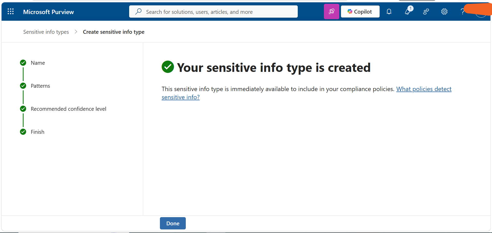

# Task 1: Create Custom Sensitive Information Types

## Objective

Create a custom Microsoft Purview Sensitive Information Type (SIT) to identify Contoso employee ID patterns.

## Configuration

Created a custom Sensitive Information Type named **Contoso Employee IDs**.

The SIT was configured with:

- **Regular expression:** Three uppercase letters followed by six digits
- **Supporting keywords:** Configured to improve detection accuracy
- **Proximity requirement:** 100 characters

## Steps Performed

1. Opened **Microsoft Purview**.
2. Navigated to **Sensitive Information Types**.
3. Created a new custom Sensitive Information Type.
4. Named the SIT **Contoso Employee IDs**.
5. Configured the regular expression to identify the required employee ID pattern.
6. Added supporting keywords.
7. Configured the keyword proximity requirement to **100 characters**.
8. Saved and verified the custom SIT configuration.

## Tools

- Microsoft Purview
- Sensitive Information Types
- Regular Expressions

## Outcome

Successfully created and configured a custom Sensitive Information Type for identifying Contoso employee IDs.

## Evidence

