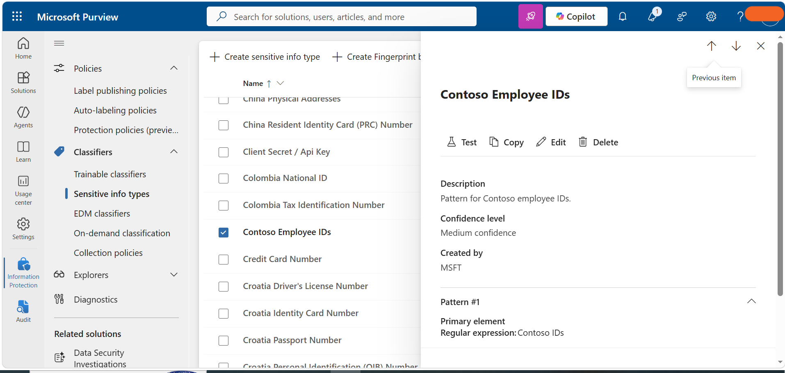

# Task 2: Modify Sensitive Information Type Confidence Level

## Objective

Modify the **Contoso Employee IDs** Sensitive Information Type (SIT) by reducing its pattern confidence level to **Medium confidence** to increase detection sensitivity.

## Configuration

Updated the **Contoso Employee IDs** Sensitive Information Type with:

- **Confidence level:** Medium confidence
- **Purpose:** Allow matches with less supporting evidence and increase detection sensitivity

## Steps Performed

1. Opened **Microsoft Purview**.
2. Navigated to **Sensitive Information Types**.
3. Located the **Contoso Employee IDs** custom SIT.
4. Modified its pattern confidence level.
5. Set the confidence level to **Medium confidence**.
6. Saved and verified the updated configuration.

## Tools

- Microsoft Purview
- Sensitive Information Types

## Outcome

Successfully updated the custom SIT to improve detection coverage during testing and policy simulation.

## Evidence

