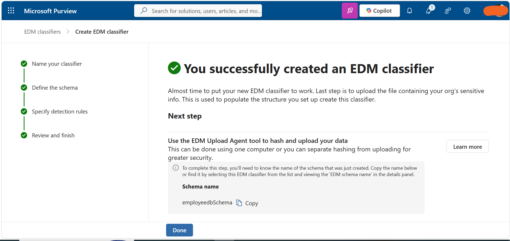

# Task 4: Create EDM-Based Classification Information Type

## Objective

Create an Exact Data Match (EDM) classifier for employee data using a manually defined employee database schema.

## Configuration

Created an EDM classifier named **employeedb** with the following configuration:

- **Classifier name:** employeedb
- **Primary element:** EmployeeID
- **Sensitive Information Type:** Contoso Employee IDs
- **Schema:** Manually defined employee database schema
- **Delimiter and punctuation settings:** Shared across the defined columns

## Steps Performed

1. Opened **Microsoft Purview**.
2. Navigated to **EDM Classifiers**.
3. Created a new EDM-based classification information type.
4. Named the EDM classifier **employeedb**.
5. Manually defined the employee database schema.
6. Configured **EmployeeID** as the primary element.
7. Associated EmployeeID with the custom **Contoso Employee IDs** Sensitive Information Type.
8. Applied shared delimiter and punctuation settings across the defined columns.
9. Submitted the EDM classifier for processing.

## Tools

- Microsoft Purview
- EDM Classifiers
- Sensitive Information Types

## Outcome

Successfully created and submitted the **employeedb** EDM classifier for employee data classification.

## Evidence

