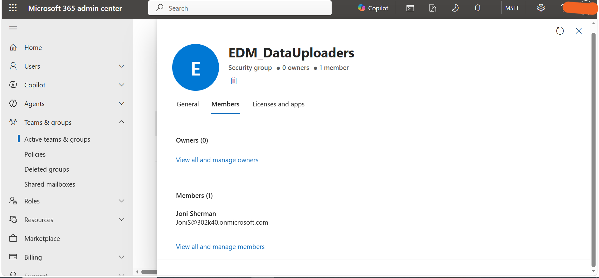

# Task 3: Create Security Group for EDM Classifier Access

## Objective

Create a security group to provide the required access for creating and managing an Exact Data Match (EDM) classifier.

## Configuration

Created a security group named **EDM_DataUploaders** and added **Joni Sherman** as a member.

## Steps Performed

1. Opened the **Microsoft 365 Admin Center**.
2. Navigated to the security groups section.
3. Created a new security group named **EDM_DataUploaders**.
4. Added **Joni Sherman** as a member of the group.
5. Verified that the group was successfully created and that Joni Sherman was added as a member.
6. Configured the group to support subsequent **Microsoft Purview EDM classifier** activities.

## Tools

- Microsoft 365 Admin Center
- Security Groups
- Microsoft Purview EDM

## Outcome

Successfully created the **EDM_DataUploaders** security group and assigned Joni Sherman as a member for subsequent EDM classifier activities.

## Evidence

