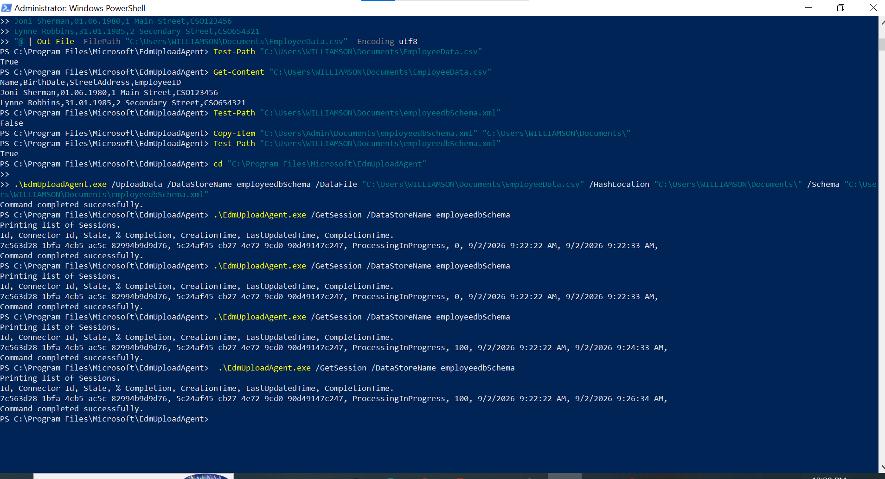
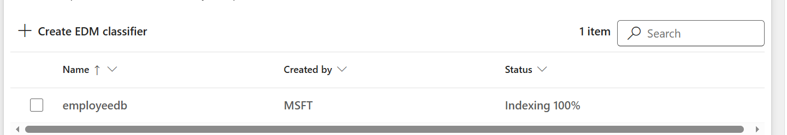

# Task 5: Create EDM-Based Classification Data Source

## Objective

Create and upload an EDM classification data source using the **EdmUploadAgent** to provide employee data for the previously created **employeedb** EDM classifier.

## Configuration

The EDM data source was prepared and uploaded with the following components:

- **EDM Upload Agent:** EdmUploadAgent
- **Schema:** Generated EDM schema XML
- **Employee data:** Prepared employee data CSV
- **Data store:** employeedbSchema

## Steps Performed

1. Prepared the employee data in CSV format.
2. Generated the EDM schema XML.
3. Used the **EdmUploadAgent** to create the EDM classification data source.
4. Uploaded the EDM schema and employee data.
5. Uploaded the data to the **employeedbSchema** data store.
6. Monitored the EDM data processing session.
7. Verified that the processing completed successfully at **100%**.

## Tools

- Microsoft Purview
- EDM Upload Agent
- PowerShell

## Outcome

Successfully uploaded the employee data and completed the EDM data processing session at **100%**.

## Evidence

### EDM Schema

### EDM Data Upload Completed

