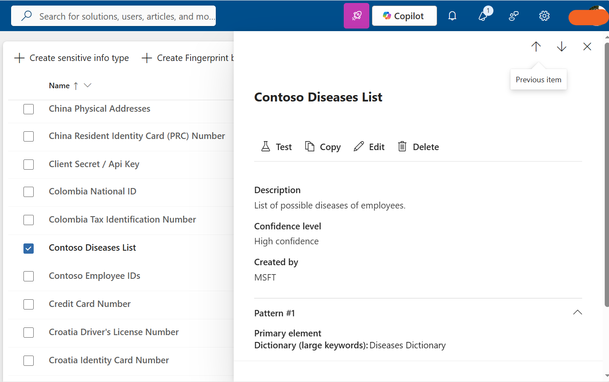

# Task 6: Create Keyword Dictionary

## Objective

Create a custom Microsoft Purview Sensitive Information Type (SIT) using a keyword dictionary to identify disease-related employee information.

## Configuration

Created a custom Sensitive Information Type named **Contoso Diseases List**.

The classifier was configured with:

- **Keyword dictionary:** Diseases Dictionary
- **Supporting keyword set:** Absence reason terms
- **Purpose:** Identify disease-related employee information and provide additional context to reduce false positives

## Steps Performed

1. Opened **Microsoft Purview**.
2. Navigated to **Sensitive Information Types**.
3. Created a new custom Sensitive Information Type.
4. Named the SIT **Contoso Diseases List**.
5. Configured the **Diseases Dictionary** keyword set.
6. Added supporting absence-related keywords using the **Absence reason terms** keyword set.
7. Saved and verified the configuration.

## Tools

- Microsoft Purview
- Sensitive Information Types

## Outcome

Successfully created and configured the **Contoso Diseases List** classifier with the **Diseases Dictionary** and **Absence reason terms** keyword sets.

## Evidence

### Contoso Diseases List Created

