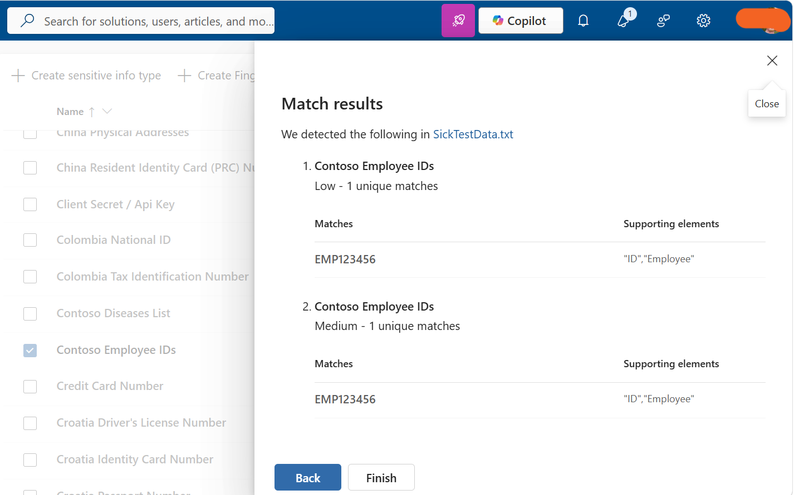
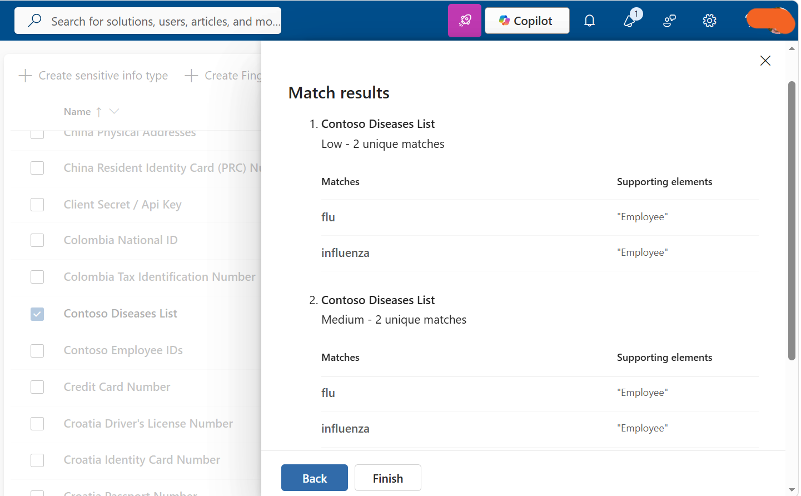

# Task 7: Test Custom Sensitive Information Types

## Objective

Test the custom **Contoso Employee IDs** and **Contoso Diseases List** Sensitive Information Types using a controlled test file containing employee ID and disease-related information.

## Configuration

The following custom Sensitive Information Types were tested:

- **Contoso Employee IDs** — Tested against the employee ID pattern.
- **Contoso Diseases List** — Tested against the configured disease-related keywords.

## Steps Performed

1. Prepared a controlled test file containing employee ID and disease-related information.
2. Opened **Microsoft Purview**.
3. Navigated to **Sensitive Information Types**.
4. Tested the **Contoso Employee IDs** Sensitive Information Type.
5. Verified that the employee ID pattern was detected.
6. Tested the **Contoso Diseases List** Sensitive Information Type.
7. Verified that the configured disease keywords were identified.
8. Reviewed the test results to confirm that both custom SITs detected the intended sensitive information.

## Tools

- Microsoft Purview
- Sensitive Information Types

## Outcome

Successfully validated both custom Sensitive Information Types and confirmed that they detect the intended sensitive information before being used in compliance policies.

## Evidence

### Contoso Employee IDs SIT Test Results

### Contoso Diseases List SIT Test Results

