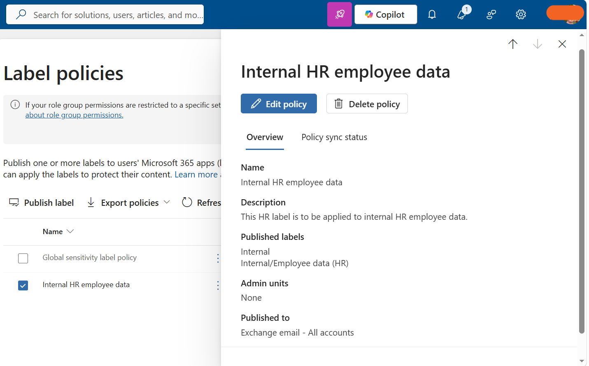

# Exercise 3 – Create and Manage Sensitivity Labels

## Overview

Implemented Microsoft Purview sensitivity labels to classify, protect, and automatically apply protection to organizational data.

## Implementation

- Enabled co-authoring support for sensitivity-labeled files in SharePoint and OneDrive.
- Migrated to the modern sensitivity label scheme.
- Created **Internal**, **Employee data (HR)**, **Financial Data**, and **Confidential Legal** labels.
- Configured encryption, access controls, content markings, and dynamic watermarking.
- Published sensitivity labels through label policies.
- Configured financial auto-labeling using Credit Card Number, ABA Routing Number, and SWIFT Code SITs.
- Configured financial auto-labeling in **simulation mode**.
- Configured **Double Key Encryption (DKE)** for confidential legal information.

## Key Capabilities

**Sensitivity Labels • Encryption • Access Control • Content Marking • Auto-labeling • DKE • Dynamic Watermarking**

## Outcome

Successfully implemented sensitivity labeling for **HR, financial, and confidential legal information** using manual and automated protection.

## Evidence

### Internal Label Group and HR Child Label

### HR Label Policy Published

