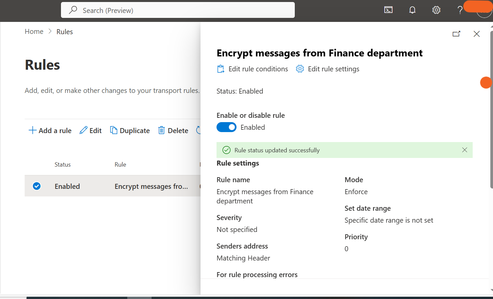
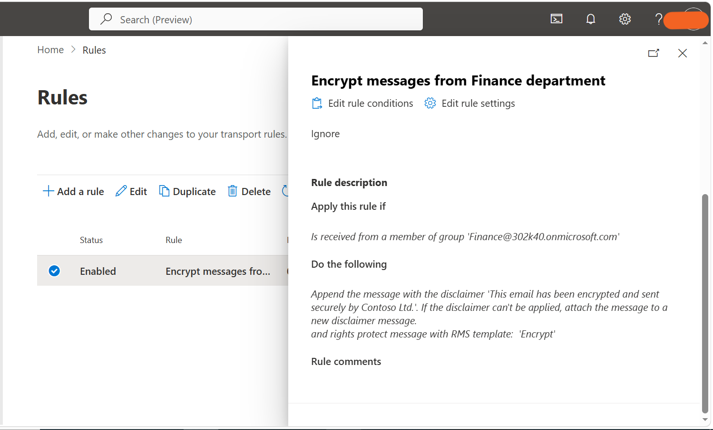

# Exercise 4 – Deploy Microsoft Purview Message Encryption

## Overview

Implemented Microsoft Purview Message Encryption through an Exchange Online mail flow rule to protect communications from the Finance department.

## Implementation

- Created the **Encrypt messages from Finance department** mail flow rule.
- Configured the rule to identify messages sent by members of the **Finance Team** group.
- Applied the **Office 365 Message Encryption – Encrypt** rights protection template.
- Added the security disclaimer: **"This email has been encrypted and sent securely by Contoso Ltd."**
- Configured the disclaimer fallback action to **Wrap**.
- Enabled the mail flow rule to enforce encryption.

## Outcome

Successfully configured automatic encryption for Finance department emails and added a security disclaimer to identify protected communications.

## Evidence

### Finance Department Mail Flow Rule

### Encryption Disclaimer

