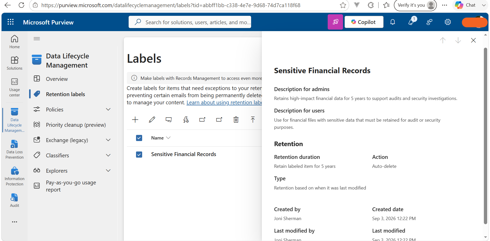
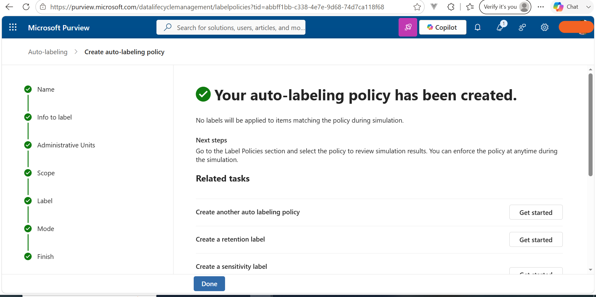
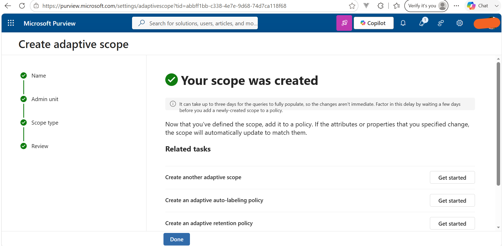
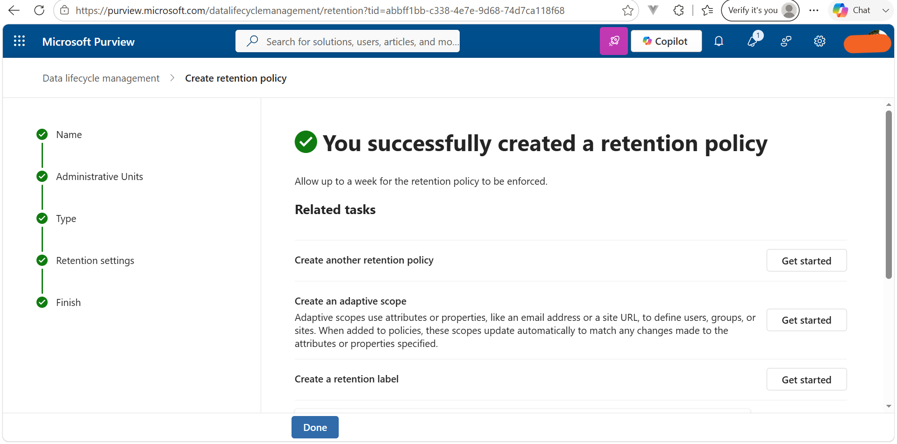

# Exercise 5 – Implement and Manage Retention

## Overview

Implemented Microsoft Purview retention capabilities to manage the lifecycle of sensitive and business data across Microsoft 365.

## Tasks Completed

### Task 1 – Create a Retention Label

Created **Sensitive Financial Records** with:

- Retention: **5 years**
- Based on: **Last modified**
- End action: **Automatic deletion**

### Task 2 – Publish a Retention Label

Published **Sensitive Financial Records** to:

- Exchange mailboxes
- SharePoint sites
- OneDrive accounts

### Task 3 – Auto-Apply Retention Label

Created **Auto-apply Personal Financial PII** using financial sensitive information and the **U.S. GLBA regulation**, with automatic application of **Sensitive Financial Records**. The policy was configured for testing before running.

### Task 4 – Static Retention Policy

Created **Teams Retention** for Teams chats and channel messages with:

- Retention: **3 years**
- Based on: **Last modified**
- End action: **Automatic deletion**

### Task 5 – Adaptive Scope

Created **Leadership and Ops Groups** targeting Microsoft 365 groups where the name is **Leadership** or **Operations**.

### Task 6 – Adaptive Retention Policy

Created **Privileged Group Retention** using the **Leadership and Ops Groups** adaptive scope for Microsoft 365 Group mailboxes and sites.

- Retention: **5 years**
- Based on: **Last modified**
- End action: **Automatic deletion**

## Skills Demonstrated

**Data Lifecycle Management • Retention Labels • Retention Policies • Auto-Apply Policies • Static Policies • Adaptive Policies • Adaptive Scopes • Sensitive Information Detection**

## Outcome

Successfully implemented retention labels, static and adaptive retention policies, auto-apply retention, and adaptive scopes across Microsoft 365.

## Evidence

### Retention Label Creation and Publishing

### Auto-Apply Retention Label Policy

### Adaptive Scope

### Adaptive Retention Policy

