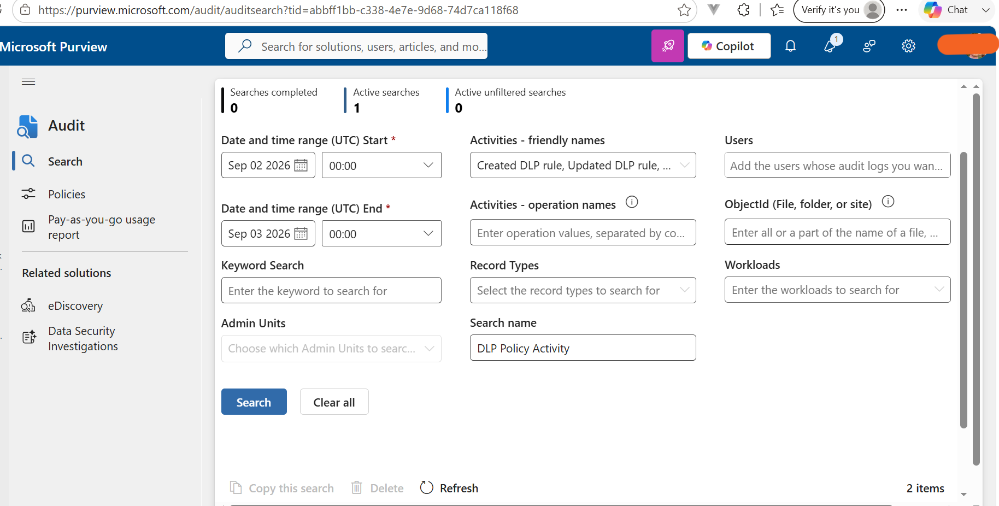
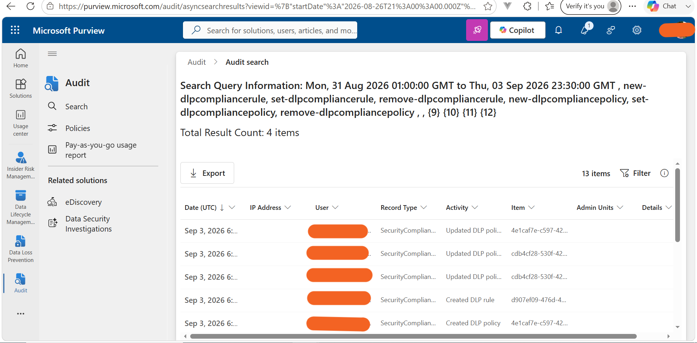
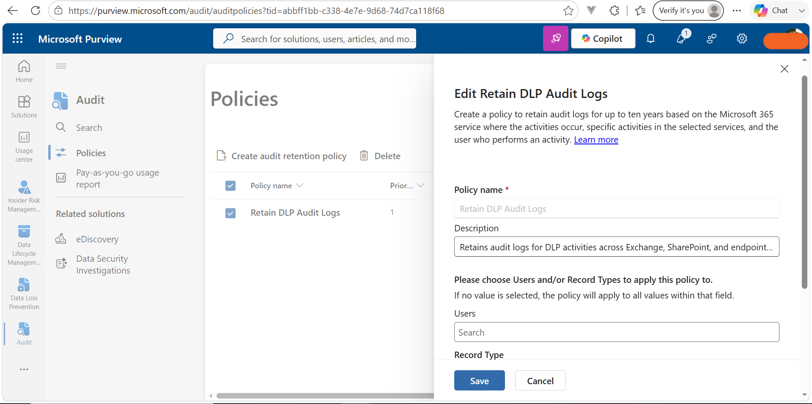

# Exercise 1 – Microsoft Purview Audit: DLP Activity & Audit Retention

## Overview

Used **Microsoft Purview Audit** to investigate DLP policy and rule activities, export audit results, and configure long-term retention of DLP audit records.

## Tasks Completed

### 1. Search for DLP Activity

- Searched Microsoft Purview Audit for DLP-related activities.
- Reviewed DLP policy and rule creation, modification, and deletion events.
- Saved the search as **DLP Policy Activity**.

### 2. Export Audit Results

- Exported the DLP audit search results in **CSV format**.
- Verified the exported records for offline investigation and compliance analysis.

### 3. Create Audit Retention Policy

Created **Retain DLP Audit Logs** with:

- **Users:** All users
- **Duration:** 1 year
- **Priority:** 1
- **Locations:** Exchange, SharePoint, and endpoints

Configured retention for DLP-related audit record types including:

- ComplianceDLPEndpoint
- ComplianceDLPExchange
- ComplianceDLPExchangeClassification
- ComplianceDLPSharePoint
- ComplianceDLPSharePointClassification

## Skills Demonstrated

**Microsoft Purview Audit • DLP Monitoring • Audit Investigation • CSV Export • Audit Retention • Compliance & Security Auditing**

## Outcome

Successfully searched and investigated DLP audit activity, exported audit evidence, and configured a **1-year DLP audit retention policy** across Exchange, SharePoint, and endpoints.

## Technologies

**Microsoft Purview • Microsoft 365 • Audit • DLP • Compliance**

## Evidence

### Search for DLP-Related Activity

### Audit Search Results

### Audit Retention Policy

