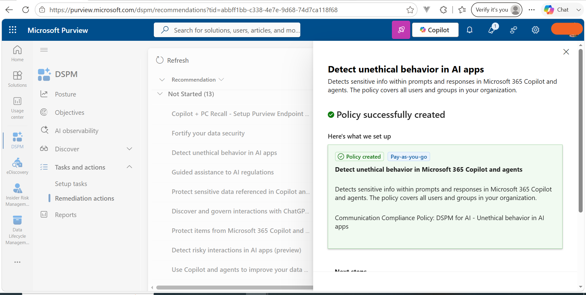
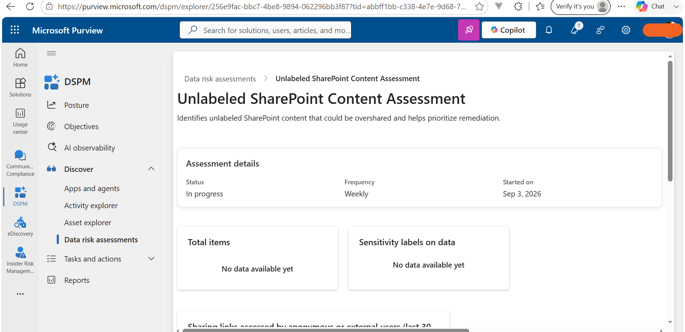

# Microsoft Purview Data Security Posture Management (DSPM)

## Overview

Implemented Microsoft Purview **Data Security Posture Management (DSPM)** to identify, assess, and reduce data security risks across Microsoft 365 and AI-related environments.

## Tasks Completed

### 1. Complete DSPM Setup

- Configured the unified DSPM setup.
- Reviewed required Audit, Insider Risk Management, and DLP analytics.
- Started the initial DSPM data scan.

### 2. Create a DSPM Remediation Policy

- Reviewed DSPM remediation recommendations.
- Selected **Detect unethical behavior in AI apps**.
- Created and verified the **DSPM for AI - Unethical behavior in AI apps** Communication Compliance policy.

### 3. Create a Data Risk Assessment

Created **Unlabeled SharePoint Content Assessment** with:

- **Scan level:** Source-level
- **Users:** All
- **Data sources:** SharePoint and OneDrive
- **Purpose:** Identify potentially overshared unlabeled content
- Started the assessment scan and reviewed its status.

## Skills Demonstrated

**Microsoft Purview DSPM • DSPM for AI • Data Risk Assessment • Data Exposure • Oversharing • AI Security • Communication Compliance**

## Outcome

Successfully configured DSPM, initiated scanning, created a remediation policy from a DSPM recommendation, and created a data risk assessment for SharePoint and OneDrive content.

## Technologies

**Microsoft Purview • DSPM • SharePoint Online • OneDrive • Communication Compliance • Data Risk Assessment**

## Evidence

### DSPM Remediation Policy

### Data Risk Assessment for Potential Oversharing

