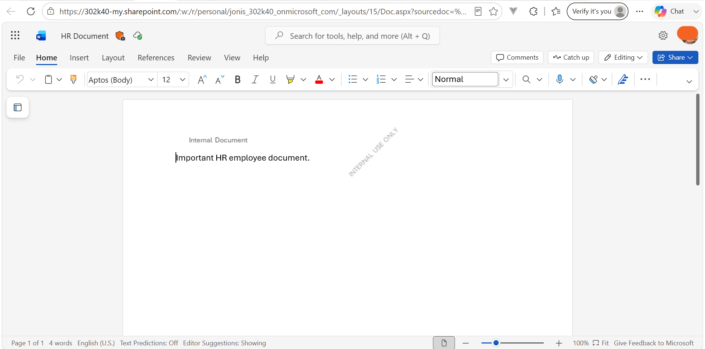
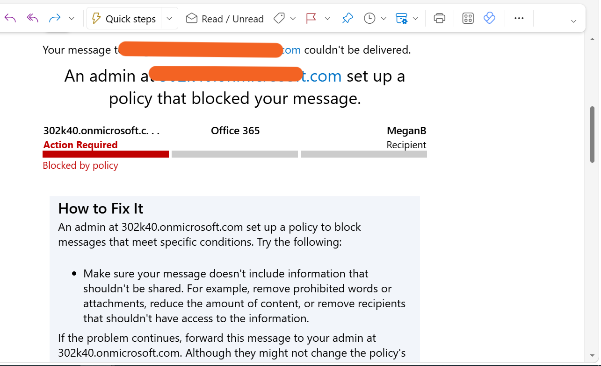

# Validation Lab – Validate Sensitivity and DLP Policies

## Overview

Validated Microsoft Purview **Sensitivity Labels and DLP policies** across Microsoft 365 applications.

## Tasks Completed

### 1. Sensitivity Label – Word

- Applied **Internal → Employee data (HR)** to a Word document.
- Tested a highly confidential label.
- Verified that a **business justification** prompt appeared.

### 2. DLP Policy – Outlook

- Created a test email containing employee identifiers.
- Verified that the DLP policy detected the sensitive information.
- Confirmed that the email was **blocked**.

## Validation Results

| Control | Application | Result |
|---|---|---|
| Sensitivity Label | Word | Passed |
| Business Justification | Word | Passed |
| DLP Policy | Outlook | Passed |

## Skills Demonstrated

**Sensitivity Labels • DLP • Microsoft Purview • Word • Outlook**

## Outcome

Successfully validated Microsoft Purview sensitivity labeling and DLP protection across Word and Outlook.

The lab demonstrated the security workflow:

**Classify → Protect → Detect → Block**

## Evidence

### Sensitivity Label Applied in Word

### DLP Policy Triggered in Outlook

